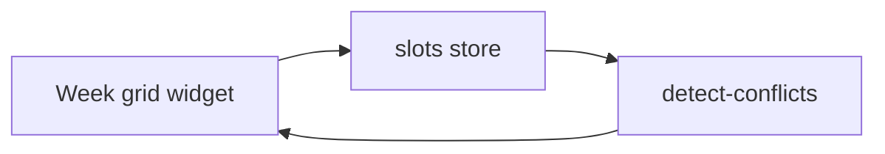

# 07-booking architecture

Weekly grid with Zustand slot list and pure conflict helpers.

```mermaid
flowchart LR
  grid[Week grid widget]
  store[slots store]
  detect[detect-conflicts]
  grid --> store
  store --> detect --> grid
```

Port **5007**; federation remote `booking/App`.
